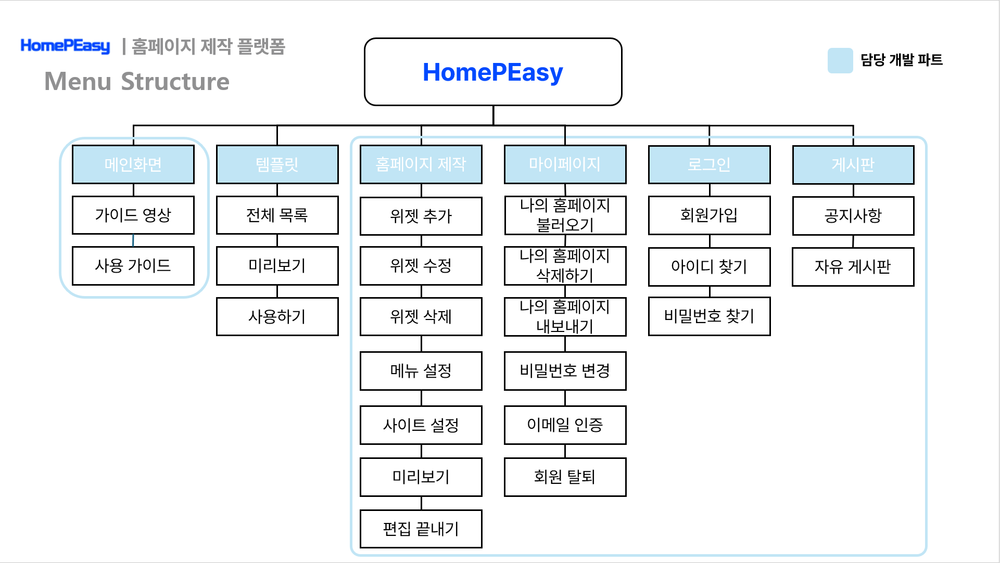

# 홈페이지 제작 플랫폼: HomePEasy

## Description
### What is HomePEasy?
- 홈페이지 제작 플랫폼은 사용자가 웹사이트를 쉽게 제작할 수 있도록 도와주는 도구입니다.  
- 사용자는 홈페이지 제작 플랫폼을 이용하여 원하는 템플릿을 선택하고, 텍스트나 이미지를 추가하여 자신만의 홈페이지를 만들 수 있습니다.

### Background
- 홈페이지 제작은 웹 개발 지식이 없는 사용자에게는 어려운 작업이다.
- 사용자가 포토샵과 코드를 몰라도 쉽게 홈페이지를 제작할 수 있는 플랫폼이 필요하다.
- 사용자가 홈페이지를 제작하는 과정에서 필요한 도움말이나 가이드가 필요하다.

### Purpose
- 사용자가 포토샵과 코드를 몰라도 쉽게 홈페이지를 제작할 수 있는 플랫폼을 개발한다.

### Features
- 사용자가 원하는 템플릿을 선택할 수 있다.
- 사용자가 텍스트나 이미지, 동영상을 추가할 수 있다.
- 사용자가 홈페이지를 제작하는 과정에서 필요한 도움말이나 가이드를 제공한다.
- 사용자가 프리셋의 저장 및 불러오기를 할 수 있다.

## Project Plan
- 2022.03.08: 팀 결성
- 2022.03.09 ~ 2022.03.30: 프로젝트 기획
- 2022.04.04 ~ 2022.04.12: MVP 개발 및 시연
- 2022.04.13 ~ 2022.04.29: 사용자 피드백 반영 및 개선
- 2022.04.30 ~ 2022.05.08: 와이어프레임 제작
- 2022.05.09 ~ 2022.05.12: 정적 페이지 개발
- 2022.07.07 ~ : React 학습
- 2022.07.29: MVP를 React JS로 마이그레이션
- 2022.08.22 ~ 2022.09.13: 개발환경 재구축(Spring + React JS → Spring + React Build)
- 2022.09.06: DB 설계 및 구축
- 2022.09.14 ~ 2022.11.13: 기능 개발
- 2022.11.14 ~ 2022.11.16: 테스트 및 배포
- 2022.11.16: 학술제 시연
- 2022.11.17 ~ 2022.11.28: 사용자 피드백 반영 및 개선

## Screenshots
### 홈페이지 화면
  
  
  

---
### 홈페이지 제작 화면
  
  
  

---
### 가이드 화면
  

---
### 홈페이지 제작 플랫폼으로 제작한 화면
  
  
